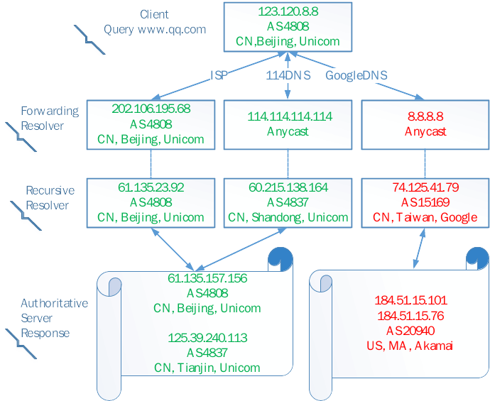

# Public Recusolver Response Accuracy Problem

Forwarding resolvers are probably to get worse response accuracy from public resolvers on non-ECS enabled authoritative server’s scenario. 

## Problem

Below shows an example of public resolver’s worse response accuracy, and compares it with ISP resolver.

We show the example of three different DNS resolution paths in the figure, which contains ISP resolver, GoogleDNS (public resolver) and 114DNS (public resolver). Compare with those using GoogleDNS, clients from { CN, Beijing, Unicom } get a better response from ISP and 114DNS, because 61.135.157.156/125.39.240.113 is obviously topological closer to 123.120.8.8 than 184.51.15.101/184.51.15.76. Further, if forwarding resolvers that serve clients from { CN, Beijing, Unicom } send the queries to ISP Resolver and 114DNS, will be better than sending to GoogleDNS. 

Similar forwarding resolvers which only send the queries to public recursive resolvers with different ASN can be adjusted to improve the response accuracy. Forwarding resolvers can consider about local public resolvers, which contain more local recursive resolvers distributed at different ASN in local ISP geolocation. For example, 114DNS can be a better choice than GoogleDNS for forwarding resolvers in China.

